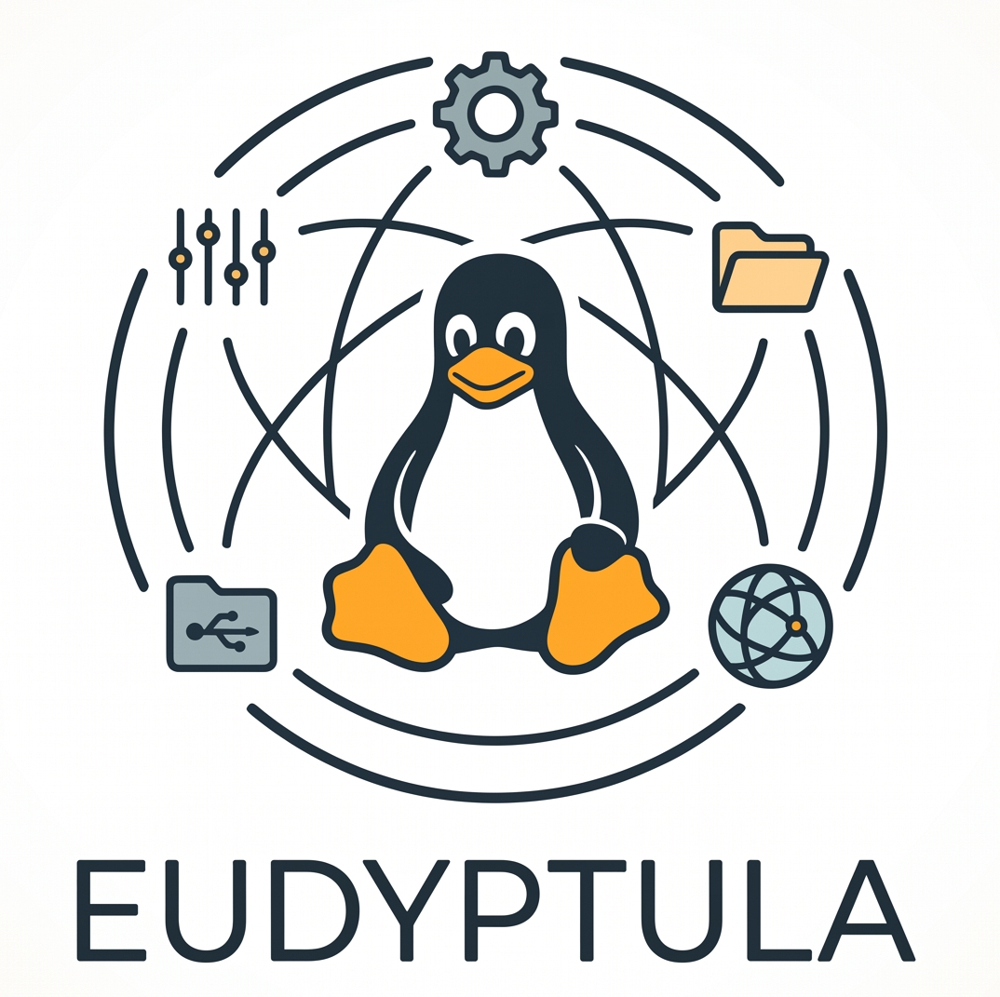

# The Eudyptula Challenge Solutions

Welcome to my documentation and walkthrough of **The Eudyptula Challenge**. 

<p align="center">

</p> 

The Eudyptula Challenge was a legendary series of 20 programming exercises designed to take developers from writing basic kernel modules to contributing directly to the Linux kernel codebase. The tasks cover writing out-of-tree drivers, configuring and building custom kernels, navigating git trees, handling kernel coding conventions, interacting with hardware events via `udev`, writing character and `debugfs` devices, navigating locking mechanisms, and contributing clean patches.

This repository serves as my personal technical logbook, documenting the code, build workflows, deep-dive conceptual notes, and solutions for each challenge.


## Recommended Setup: Use a Virtual Machine

Before compiling kernels or running experimental kernel-space code, **it is strongly recommended** to set up a dedicated Virtual Machine (VM) rather than developing directly on your host machine.

### Why a VM?

1. **Kernel Space has No Safety Net:** Unlike user-space applications where a segmentation fault simply terminates the process, a bug in kernel space (e.g., a dereferenced null pointer, an improper lock, or an infinite loop in interrupt context) triggers a **Kernel Panic** or hard-locks your entire CPU.

2. **Device Nodes & Modules:** Installing custom kernel modules into `/lib/modules/$(uname -r)/` and manipulating `/dev` or `/sys` nodes can alter your host OS's hardware state and package integrity.

3. **Reproducibility:** A clean VM (such as Fedora or Debian running in QEMU/KVM or VirtualBox) provides a clean sandbox you can snapshot, break, and restore in seconds.

### Recommended Workflow: Shared Folders

To get the best of both worlds (using your host machine's editor, configs, and Git setup while executing code safely) I recommend the following approach:

* **Host:** Write your code, patches, version control (Git), and documentation.

* **VM:** Mount your project folder via a shared directory and run all builds, module insertions (`insmod`), and test boots inside the guest.

## Prerequisites & Tooling

Most challenges are completed and verified on **Fedora Linux**, but any modern distribution works. The essential build toolchain and kernel development packages include:

```bash
# Fedora
sudo dnf install gcc clang make bison flex elfutils-libelf-devel openssl-devel kernel-devel-$(uname -r) kernel-headers git git-email neomutt qemu-system-x86

# Debian / Ubuntu equivalent
sudo apt update && sudo apt install build-essential libncurses-dev bison flex libssl-dev libelf-dev linux-headers-$(uname -r) git git-email neomutt qemu-system-x86

```

